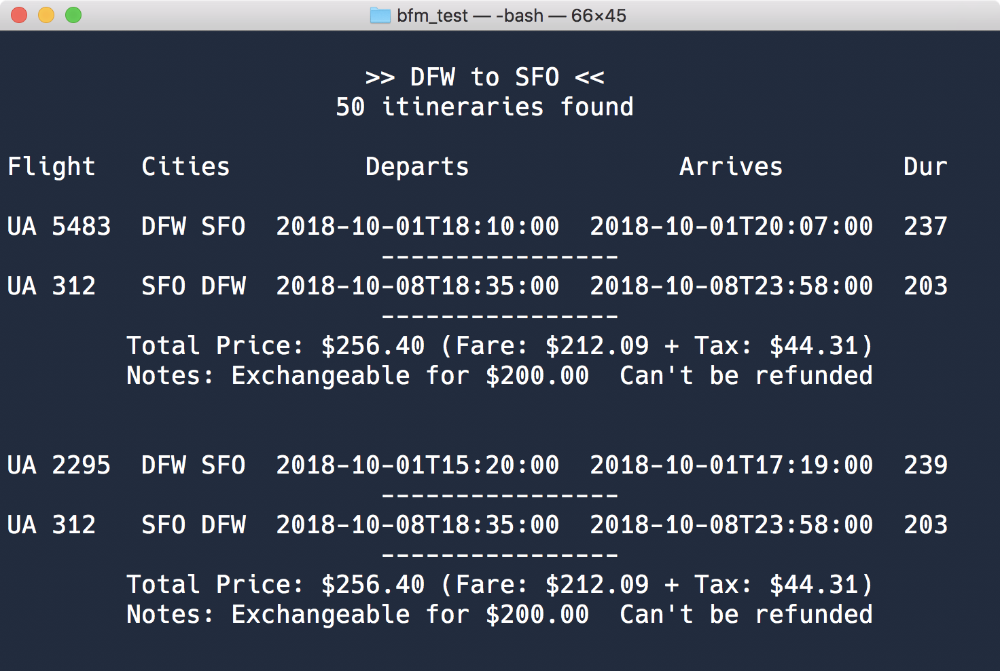

# Searching for Airfare with the Bargain Finder Max API
## Introducing this Code Sample

We offer an API called [Bargain Finder Max.](https://developer.sabre.com/docs/read/rest_apis/air/search/bargain_finder_max) It’s a highly capable service empowering software developers to access the Sabre air shopping engine to find low-cost fares. It’s built to be fast and [flexible.](http://files.developer.sabre.com/doc/providerdoc/shopping/BargainFinderMax_Help/BargainFinderMax_Help.htm#Getting_Started/FeaturesofBFM.htm) 

Bargain Finder Max (BFM) is one of our more popular APIs, and that influenced our choice to create a new sample app. It shows how developers can easily call BFM, parse the results, and display the content. Our goal is making it quicker for developers to get started using the API. 

What does the sample app look like when it runs? Here’s a screen shot:



## Read the Article

There's [an article](https://blog.developer.sabre.com/) serving as a partner to this sample app source code. You’ll find explanations and additional resources written in it to add context whenever possible. 

## Setting-up the Sample App

There are a few one-time only steps for installing pre-requisites listed below.

## Installing NodeJS

The sample app is written in NodeJS. You’ll need to have its run-time installed on your local development computer. If you’ve never installed NodeJS please refer to the [Node Foundation](https://nodejs.org/en/download/) to find an installer most appropriate for your O/S. 

## Cloning with Git

Take a copy of the source code from our [repo stored on GitHub.](https://github.com/SabreDevStudio) When you browse the BFM sample app repo you’ll find the green button labeled “clone”. Clicking it reveals the URL you’ll use to `git clone`, which is how source code is first copied down from the server to your computer. 

## Getting Sabre API Credentials

You’ll need your [Sabre REST APIs CERT-environment credentials.](https://developer.sabre.com/resources/getting_started_with_sabre_apis/) They’re used by the sample app as part of the authentication flow to call Bargain Finder Max.

## Installing Project Dependencies

Once you’ve installed NodeJS, and pulled down a copy of the source code, you’ll need to install the app’s open-source dependencies. That’s accomplished by running this command in the local copy of the source code:

`npm install`

The [npm](https://www.npmjs.com/) (Node Package Manager) tool will pull down copies of all open-source code this app refers to. File transfers might take a few minutes.

## Encoding Credentials

Using the APIs requires entering credentials so that the app can find them. Part of its logic is requesting a token in order to properly call the Bargain Finder Max API. Tokens are gained in part from private credentials.

Simply open up the app’s source code and look at the file named [`config.js`](./src/config.js) to find where they’re declared. There are two attributes (`secret` and `pcc`) where values can be copied-in as hardcoded strings or picked-up from O/S environment variables that you create on your local development machine.

```
exports.api = {
  endpoint: 'https://api.test.sabre.com',
  secret: process.env.SWS_API_SECRET || '',
  pcc: process.env.SWS_API_PCC || ''
};
```

Environment variables are preferred in this sample app because it keeps them hidden and protected. In this case all code is publicly visible in revision control, and that’s not the place for private information.

* `pcc` - is the pseudo city code (your agency’s unique identifier)
* `secret` – is a base64-encoded string computed from steps you can [read more about](https://developer.sabre.com/page/read/resources/getting_started_with_sabre_apis/how_to_get_a_token)

## Running the Sample App

The sample app is ready to run after setup. Enter this command in the local copy of the source code to run the sample app:

`npm start` 

When this works normally the app renders a list of itineraries as seen in the image above. Results match the origin and destination for a given date range.

## Updating the Search Criteria Config File

Changing search criteria is easy. Simply open up the app’s source code, and look at the file named [`search_criteria.json`](./src/search_criteria.json) to find airport and date pairs. Update any of the attributes to valid values and restart the app to see the search results.

```
{
  "fromAirportCode": "DFW",
  "toAirportCode": "SFO",
  "timeStampLeave": "2018-10-01T11:00:00",
  "timeStampReturn": "2018-10-08T11:00:00"
}
```

## Next Steps

Make use of this sample app as a testing tool. It’s a simple, flexible, jumping-off point for learning how to use Sabre APIs in general, and Bargain Finder Max in particular. Look up the [BFM docs](https://developer.sabre.com/docs/read/rest_apis/air/search/bargain_finder_max) and discover all that it can do. Find something interesting? Call it by changing the request attribute values found in the file [bfm_model.js.](./src/bfm_model.js) Save and run to see what new capabilities do. 

Get in touch with us. GitHub allows communication through its repo-level issue and pull request channels. We also have an active community on [Stack Overflow.](https://stackoverflow.com/questions/tagged/sabre) 
